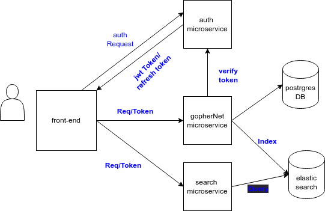

# Architecture project

## Objective

> This assignment aims to evaluate your understanding and proficiency in cloudarchitecture. You should demonstrate your ability to design a robust, scalable, andefficient cloud solution for a hypothetical burrow advertising platform, GopherNet.

GopherNet is an emerging digital platform that facilitates advertising for gopherburrows, serving thousands of users daily. It has multiple components, including user registration and authentication, search functionality and burrow ad placement.GopherNet is looking to transition from it’s current traditional server setup to ascalable and efficient cloud-based infrastructure.Design an architecture to support the GopherNet platform. Your design should usecloud services from your preferred cloud provider (eg, AWS, GCP)Your solution should ensure high availability, scalability, and cost-effectiveness.Task 1Draw a detailed diagram of your proposed cloud architecture. The diagram shouldclearly illustrate how different components of the architecture interact with eachother. You may use any diagramming tool of your choice.Task 2Write a paragraph for the following topics:How to manage and provision production, test and dev environmentsBasic explanation of how deployments will workHigh-level explanation of the local development workflowTask 3In a few small paragraphs - discuss how your cloud architecture could handle asudden surge in traffic, which might occur due to a promotional event. Explain howyour design maintains high performance and availability during these peak times.DeliverableYour final submission should include your architecture diagram and writtenexplanations. Please package these into a single PDF document.We look forward to your creative solutions.

## Task 1

Draw a detailed diagram of your proposed cloud architecture. The diagram should clearly illustrate how different components of the architecture interact with eachother. You may use any diagramming tool of your choice.

### proposed Architecture

## Task 2

Write a paragraph for the following topics:How to manage and provision production, test and dev environmentsBasic explanation of how deployments will workHigh-level explanation of the local development workflow

## Task 3
In a few small paragraphs - discuss how your cloud architecture could handle asudden surge in traffic, which might occur due to a promotional event. Explain howyour design maintains high performance and availability during these peak times.