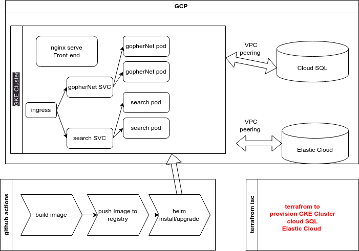

# Architecture project

## Objective

This assignment aims to evaluate your understanding and proficiency in cloud architecture. You should demonstrate your ability to design a robust, scalable, and
efficient cloud solution for a hypothetical burrow advertising platform, GopherNet.GopherNet is an emerging digital platform that facilitates advertising for gopher
burrows, serving thousands of users daily. It has multiple components, including user registration and authentication, search functionality and burrow ad placement.
GopherNet is looking to transition from it’s current traditional server setup to a scalable and efficient cloud-based infrastructure. Design an architecture to support 
the GopherNet platform. Your design should use cloud services from your preferred cloud provider (eg, AWS, GCP) Your solution should ensure high availability, scalability, 
and cost-effectiveness.
### Task 1
Draw a detailed diagram of your proposed cloud architecture. The diagram should clearly illustrate how different components of the architecture interact with each
other. You may use any diagramming tool of your choice.
### Task 2
Write a paragraph for the following topics:
How to manage and provision production, test and dev environments Basic explanation of how deployments will work High-level explanation of the local development workflow
### Task 3
In a few small paragraphs - discuss how your cloud architecture could handle a sudden surge in traffic, which might occur due to a promotional event. Explain how
your design maintains high performance and availability during these peak times.

---

#   Solution:
## Task 1

Certainly! Here's a rephrased version:

**Diagram 1: Application Architecture for Deployment on GCP Kubernetes Cluster**

Illustrate the application architecture and its components to be deployed on a Kubernetes cluster hosted on Google Cloud Platform (GCP). The deployment will utilize Helm to manage the application deployment on the cluster.

**Diagram 2: Cloud Architecture for Application Deployment**

Present the cloud architecture design outlining the infrastructure setup to deploy the application effectively. This includes the configuration and arrangement of resources required for deploying the application on the chosen cloud provider.

  

## Task 2

### Management and Provisioning of Production, Test, and Development Environments

In managing the different environments (production, test, and development), a distinct Virtual Private Cloud (VPC) and a separate Google Kubernetes Engine (GKE) cluster will be set up for each. Infrastructure provisioning will be orchestrated using Terraform, with dedicated Terraform modules created for each environment. Terraform workspaces will be utilized for efficient management of these distinct environments.

### Deployment Approach

For the deployment process:
- Docker images will be built and pushed to Docker Hub using GitHub Actions.
- Terraform will be employed to deploy the application to the respective environments by using Terraform helm provider to  handle application deployment to the Kubernetes cluster in each environment.
- Alternatively, GitHub Actions can also be utilized for deploying the application to the different environments.

### Local Development Workflow Overview

- Local development and testing of application code we can use docker-compose to run the application locally .
- GitHub Actions automating the build process, generating Docker images, and storing them in Docker Hub.

## Task 3

To scale the application to handle a sudden surge in traffic, I will use the following:

In the application I will use the following:
1. add caching to the application to reduce the number of requests to the database.
2. add asnyc tasks to the application to handle long running tasks.

In the kubernetes cluster I will use the following:

1. I will use a sevice of type load balancer to distribute the traffic between the different pods. 
2. I will use a horizontal pod autoscaler to scale the pods based on the cpu usage. 
3. I will use a cluster autoscaler to scale the cluster based on the number of pending pods.
4. I will use a pod disruption budget to make sure that there is always a minimum number of pods running.